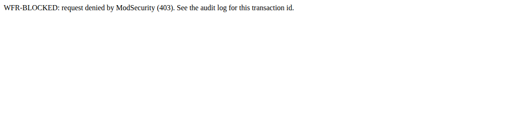

# WAF Flight Recorder

[](https://github.com/albeen-sknight/waf-flight-recorder/actions/workflows/lab.yml)

I put a real web application firewall in front of a shop that's broken on purpose. Then I attacked it, wrote my own rules, broke them, found a false positive in the official ruleset and fixed it without opening a hole. Every claim below has an audit log entry behind it and a test that fails the moment it stops being true.


## About me

I'm Aboulfazl Saeedi (Albeen on GitHub). I'm 19, I live in Madrid, and I'm in my second year of ASIR (network systems administration) at IES Clara del Rey.

I came to Spain from Iran at 13 without proper Spanish or English. Bachillerato closed for me, so I took the FP route instead. SMR, an Erasmus placement in Malta, then ASIR. That "plan B" turned out to be the road that opened my career.

In May 2026 I did Deloitte's Technology Trainee program on the CyberSOC track. Over the summer I worked as an on site support engineer, installing Cisco and Meraki kit and supporting users across Madrid and Sevilla. In my own time I build SIEM labs with Elastic and Kibana: failed logon dashboards, Windows Event Log investigations, the basics of incident response.

My plan is simple. SOC first. Strong foundations first. Application security and WAF later.

## Why I built this

During the Deloitte program I met a Senior WAF Engineer who'd started out doing ASIR, just like me. That made the path real. It also showed me a gap: everything I'd actually touched was SIEM and log analysis. WAF was something I talked about, not something I'd done.

So I wanted proof I could put on the table. Not "WAF is my career direction". Instead: "here's a WAF I deployed, attacked and tuned, and I can explain every decision it made."

My first idea was to write my own WAF engine from scratch. I dropped it. It's weeks of HTTP parsing and regex plumbing, and it teaches you about building software more than about how a WAF engineer spends the day. A WAF engineer works with a mature engine and a mature ruleset: reading rules, chasing false positives, tuning without weakening protection. So that's what I did. ModSecurity is the engine. OWASP CRS is the ruleset. I worked at the rule and tuning layer, where the real decisions get made.

## What the lab is for

For every request I want to answer five questions:

1. What did the WAF inspect?
2. Which rule fired?
3. Why did it fire?
4. What did the WAF decide?
5. How would I tune that decision safely?

It's a defensive learning lab. It doesn't protect anything real, and all the attack traffic goes to a local target I own.

## What I built

```
 browser / test runner ──▶ 127.0.0.1:8080 ──▶ WAF: Apache 2.4.58 + ModSecurity 2.9.7 + OWASP CRS v4.29.0
                                                    │ allowed requests only
                                                    ▼
                                    OWASP Juice Shop v20.2.0 (internal network, no published port)

 WAF ──▶ evidence/raw/audit.json   one JSON line per request: the "flight recorder"
```

| Piece | What I used | Why |
| --- | --- | --- |
| Target | [OWASP Juice Shop](https://owasp.org/www-project-juice-shop/) v20.2.0, the official image `bkimminich/juice-shop` | Insecure on purpose, maintained by OWASP, full of realistic routes and real vulnerabilities |
| Engine | ModSecurity 2.9.7 on Apache 2.4.58 (Ubuntu 24.04 packages) | The reference engine for CRS |
| Ruleset | OWASP CRS v4.29.0, pinned, never edited | The production grade ruleset I wanted to learn |
| My layer | 9 rules of my own, 2 exclusions, CRS settings | Kept in separate files so every change is visible in git |
| Proof | 45 YAML scenarios, pytest, GitHub Actions | Every claim is a test |
| Isolation | Docker Compose, internal network, localhost binding | Juice Shop never touches the internet |

More detail: [architecture](docs/architecture.md).

## How I built it, phase by phase

### Phase 0: the traffic path

I started with nothing but plumbing. Browser to WAF to Juice Shop, one command to start it.

- I built my own WAF image from `ubuntu:24.04` with the Ubuntu packages for Apache and ModSecurity, and pulled CRS at a pinned tag. Building it myself meant I knew every file in it.
- Juice Shop got an internal Docker network and no published port. The only way in is through the WAF.
- The WAF listens on `127.0.0.1:8080`, so nothing on my LAN can reach it.

```bash
docker compose up -d --build
```

The first thing I hit: ModSecurity refuses some engine directives inside an Apache `<VirtualHost>`. So the whole ModSecurity config loads at server level, from one file, [`modsecurity/main.conf`](modsecurity/main.conf), which fixes the load order. That file is the first thing I'd tell anyone to read.

### Phase 1: learning to read the audit log

Before writing a single rule I made sure I could read what ModSecurity sees. I turned the audit log on for every request, in JSON, and made the WAF hand back its transaction id in an `X-WFR-Transaction` header so I could jump from a response to its log entry.


Then I sent the same SQL injection string twice: once in DetectionOnly, once enforcing.


Same rules, same score. 200 in DetectionOnly, 403 when enforcing. I wrote up one real entry part by part: [how I read a transaction](docs/how-to-read-a-transaction.md).

### Phase 2: my own rules

I wrote small rules I could explain line by line. Each one taught me one decision: phase, target, operator, transformation, action.

| Rule | Lab | What it does | What it taught me |
| --- | --- | --- | --- |
| 100001 | Header | Blocks the lab marker `WFR-Lab-Bot` in the User Agent | Phase 1, one header, `@contains` cares about case |
| 100010 | Method | Refuses WebDAV methods with a 405 | `@within` is a substring test, so it would've blocked PATCH. I used an anchored regex instead |
| 100020 / 100040 | Route + transformations | Virtual patch for Juice Shop's exposed `/ftp` folder, written twice | `/FTP/` gets past the version without `t:lowercase` |
| 100030 | Argument | Blocks one named argument | JSON fields become `ARGS:comment`, `ARGS:a.b`, not `json.comment` like I first assumed |
| 100050 | False positive on purpose | Blocked "cough drops", then got fixed | My own rules need the same tuning loop as CRS |
| 100060 | Chain | Denies `DELETE` on `/api/Feedbacks` only | Two harmless conditions, one blocked combination |
| 100070 / 100071 | Scoring | Adds 5 points in phase 2, and in phase 1 | The phase 1 version does nothing at all |

Why `/ftp`? With the WAF in DetectionOnly, this is what Juice Shop serves to anyone who asks:


Backups, a password database, an encrypted announcement. With rule 100020 enforcing, the same URL gets this:


And every rule has scenarios for what it must block and what it must let through:


Details for every rule: [ModSecurity notes](docs/modsecurity-notes.md). The rule files themselves explain each choice in their comments: [`modsecurity/custom-rules/`](modsecurity/custom-rules/).

### Phase 3: a test harness, so I stop clicking

Clicking around doesn't prove anything twice. So every request became a YAML scenario: the request, plus what the WAF must do with it. My runner sends it, finds the exact audit log entry by transaction id, and checks the decision, the denying rule, the matched rules and the score. It refuses to send anything outside the lab.

pytest runs all of it, plus config checks (unique rule IDs, ID ranges, include order) and isolation checks. GitHub Actions builds the real Docker stack with the real Juice Shop and runs everything on every push.


### Phase 4: CRS, and taking its rules apart

Then I loaded CRS at paranoia level 1 and attacked Juice Shop with classic test strings: SQL injection, XSS, path traversal, command injection, a scanner User Agent. All blocked.


The famous Juice Shop admin login bypass, `' OR 1=1--` as the email, doesn't log anyone in anymore. The WAF drops the request before Juice Shop sees it.





Seeing a 403 isn't the same as understanding it, though. So I picked five CRS rules and took each one apart: targets, transformations, operator, score, and what happens when I change exactly one thing about the input.

| Rule | What I found |
| --- | --- |
| [942100](docs/crs-rule-autopsies/942100.md) | It's a SQL tokenizer, not a regex. `O'Reilly` passes. `1 OR 1=1` doesn't |
| [941110](docs/crs-rule-autopsies/941110.md) | Six transformations decode HTML entities before the regex even runs |
| [930120](docs/crs-rule-autopsies/930120.md) | A phrase list from a data file. No regex at all |
| [932235](docs/crs-rule-autopsies/932235.md) | Needs a prefix, a command and a delimiter. A pasted URL supplies two of them by accident |
| [920350](docs/crs-rule-autopsies/920350.md) | Matches a numeric Host header, scores 3, never blocks on its own |

### Phase 5: anomaly scoring

CRS rules don't block. They add points. One rule, 949110, compares the total with a threshold and denies.


- A numeric Host header alone scores 3. Logged, allowed.
- Add an empty User Agent (2 more) and it hits 5. Blocked.
- My scoring rule in phase 1 gets wiped, because CRS resets the score after it runs. The same rule in phase 2 blocks.

Then the experiment that changed how I think about tuning. I raised the threshold from 5 to 10:


The login bypass, the search SQL injection and the sqlmap scanner all walk straight through. Lots of real attacks trip exactly one critical rule. Double the threshold and CRS goes blind to all of them. Full write up: [anomaly scoring experiment](docs/anomaly-scoring-experiment.md).

### Phase 6: a real false positive, fixed narrowly

I threw about 40 realistic customer comments at the feedback form, looking for something CRS would get wrong. The most natural one: a customer pasting a newsletter link.

```
The link https://example.com/?ref=juice&utm_source=mail in your newsletter has a typo
```

Blocked. CRS 932235 sees `=` plus `mail` plus a space and calls it Unix command injection.


The lazy fixes were right there. Delete the rule. Ignore the `comment` field everywhere. Raise the threshold. Each one opens a hole I'd just measured. So I wrote one runtime exclusion that removes one rule (932235) from one argument (`comment`) on one route (`POST /api/Feedbacks`). Then I proved four things: the comment goes through, command injection and XSS in that same field are still blocked, the same pattern in another argument still fires, and the same comment sent to another route is still blocked.


Two more tuning cases came out of the build. CRS out of the box blocks Juice Shop's own `PUT` and `DELETE` requests, so changing your basket simply didn't work; the fix was a CRS setting, not an exclusion. And my own rule 100050 blocked a shopper searching for "cough drops":


Everything is in the [tuning journal](docs/tuning-journal/): [FP-001](docs/tuning-journal/FP-001.md), [FP-002](docs/tuning-journal/FP-002.md), [LAB-F](docs/tuning-journal/LAB-F.md).

## What I learned

- A rule matching and a request getting blocked are two different events. In CRS, only 949110 blocks.
- Phase decides whether a rule does anything at all.
- Transformations are where a simple regex gets its strength. Apache also cleans up the path before ModSecurity sees it, which I didn't expect.
- The threshold isn't a tuning knob for false positives. It's a switch that turns off detection for every attack that trips exactly one critical rule.
- A good fix is narrow, and it comes with two tests: the legit request passes, the attack still gets blocked.

## Run it yourself

You need Docker Desktop.

```bash
git clone https://github.com/albeen-sknight/waf-flight-recorder.git
cd waf-flight-recorder
docker compose up -d --build                    # http://localhost:8080
docker compose --profile test run --rm tests    # every scenario against the live WAF
docker compose down
```

Poke it by hand:

```bash
curl -i "http://localhost:8080/rest/products/search?q=apple"              # 200, allowed
curl -i "http://localhost:8080/rest/products/search?q=%27%20OR%201%3D1--" # 403 WFR-BLOCKED
curl -i -A "WFR-Lab-Bot/1.0" http://localhost:8080/                       # 403, my rule 100001
python3 tools/summarize_audit.py -n 5                                     # what fired, and why
```

Experiment knobs:

```bash
WFR_RULE_ENGINE=DetectionOnly docker compose up -d   # log everything, block nothing
WFR_INBOUND_THRESHOLD=10 docker compose up -d        # watch what slips through
```

No Docker? On Ubuntu 24.04 the same config runs natively, with a tiny echo app standing in for Juice Shop:

```bash
sudo apt-get install -y apache2 libapache2-mod-security2 python3-pytest python3-yaml python3-requests
sudo git clone --depth 1 --branch v4.29.0 https://github.com/coreruleset/coreruleset.git /opt/crs
tools/native-lab.sh install && tools/native-lab.sh start
python3 -m pytest
```

## Repository layout

```text
compose.yaml                 waf + juice-shop (+ tests, cloudflared profiles)
waf/                         my WAF image: Dockerfile, install.sh, Apache vhost
modsecurity/
  main.conf                  include order. Read this first
  modsecurity.conf           engine, body access, JSON audit log
  crs-setup.conf             paranoia level, threshold, allowed methods
  custom-rules/              my rules, IDs 100000 to 100999
  exclusions/                tuning, IDs 1000 to 1999 (before and after CRS)
crs/README-version.md        pinned CRS tag. CRS itself is never edited
scenarios/                   normal/, controls/, false-positive/ (YAML)
tests/                       pytest: scenarios, config checks, isolation
tools/                       scenario runner, audit summarizer, native lab, stand in backend, screenshots
docs/                        architecture, notes, autopsies, scoring, tuning journal, screenshots
evidence/sanitized-samples/  real audit entries, sanitized (raw logs stay out of git)
```

## Safety

- Juice Shop lives on an internal Docker network with no published port.
- The WAF listens on `127.0.0.1`. My LAN can't see it.
- The scenario runner refuses anything that isn't the lab.
- Synthetic data only. I sanitize audit samples before committing them.

## What's next

- [x] MVP: ModSecurity, my own rules, tests, audit log notes
- [x] V1: CRS, five autopsies, anomaly scoring, a real false positive, a narrow exclusion, regression tests, CI
- [ ] A private demo link through Cloudflare Tunnel + Access, and a head to head with Cloudflare's free WAF
- [ ] V2: paranoia levels 2 and 3, response body rules, libModSecurity v3 + Nginx

## References

- [OWASP Juice Shop](https://owasp.org/www-project-juice-shop/) (I use the official image, unmodified)
- [ModSecurity Reference Manual](https://github.com/owasp-modsecurity/ModSecurity/wiki)
- [OWASP CRS docs](https://coreruleset.org/docs/), especially [false positives and tuning](https://coreruleset.org/docs/2-how-crs-works/2-3-false-positives-and-tuning/)
