# WAF Flight Recorder

[](https://github.com/albeen-sknight/waf-flight-recorder/actions/workflows/lab.yml)

I put a real web application firewall in front of a shop that's broken on purpose. Then I attacked it, wrote my own rules, broke them, found a mistake in the official ruleset and fixed it without opening a hole. Every claim below has a log entry behind it and a test that fails the moment it stops being true.

This README is two things at once. It's the story of a project I built. And it's a handbook: if you've never touched a WAF, you can read it top to bottom and learn what I learned, in the order I learned it. Every new idea gets an everyday example first and the technical name second. Every command has a comment saying what it actually does.

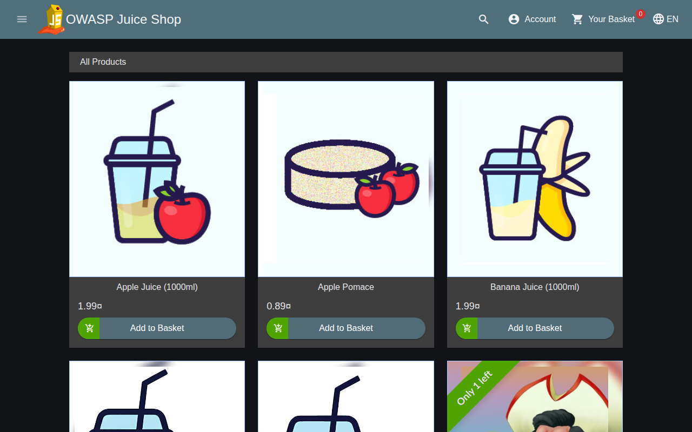

*The real Juice Shop, running behind my WAF.*

## Contents

1. [What this project is](#what-this-project-is)
2. [About me](#about-me)
3. [Why I built it](#why-i-built-it)
4. [How I learned it](#how-i-learned-it)
5. [Time taken](#time-taken)
6. [What it's for](#what-its-for)
7. [What I built, in plain words](#what-i-built-in-plain-words)
8. [How I built it, phase by phase](#how-i-built-it-phase-by-phase)
9. [What I learned](#what-i-learned)
10. [Run it yourself](#run-it-yourself)
11. [Glossary](#glossary)
12. [Repository layout, safety, what's next](#repository-layout)

## What this project is

Picture a shop that's been built full of holes on purpose, so people can practise breaking in without hurting anyone. That shop exists. It's called [OWASP Juice Shop](https://owasp.org/www-project-juice-shop/), it sells juice, and it's used all over the world for security training.

Now picture a security guard at the shop's front door. Every visitor gets checked before they reach the counter. That guard is a **WAF**, a web application firewall.

In this project I'm the person training that guard. I gave the guard a professional rulebook, wrote extra instructions of my own, sent fake burglars at the door to see who got caught, found a case where the guard stopped an honest customer, and fixed it without letting the burglars back in. And I wrote everything down, with proof.

It's a learning lab. It doesn't protect anything real, and every attack goes to a copy of the shop running on my own computer.

## About me

I go by Albeen here on GitHub. I'm 19, I live in Madrid, and I'm in my second year of ASIR (network systems administration).

I moved to Spain from my home country when I was 13, without proper Spanish or English. Bachillerato wasn't an option for me, so I went down the vocational route (FP) instead: SMR, an Erasmus placement abroad, then ASIR. That "plan B" ended up being the road that opened my career.

In May 2026 I did Deloitte's Technology Trainee program on the CyberSOC track. Over the summer I worked as an on site support engineer, installing Cisco and Meraki kit and supporting users across Madrid and Sevilla. In my own time I build SIEM labs with Elastic and Kibana: failed logon dashboards, Windows Event Log investigations, the basics of incident response.

My plan is simple. SOC first. Strong foundations first. Application security and WAF later.

## Why I built it

During the Deloitte program I met a Senior WAF Engineer who'd started out doing ASIR, just like me. That made the path real. It also showed me a gap: everything I'd actually touched was SIEM and log analysis. WAF was something I talked about, not something I'd done.

So I wanted proof I could put on the table. Not "WAF is my career direction". Instead: "here's a WAF I deployed, attacked and tuned, and I can explain every decision it made."

My first idea was to write my own WAF from scratch. I dropped it. That's like learning to be a referee by building a stadium: weeks of construction, and you still haven't refereed a match. A WAF engineer works with a mature engine and a mature rulebook. The real job is reading rules, chasing false alarms, and tuning without weakening protection. So that's what I did.

## How I learned it

I'm still learning, so I built this the way a lot of people learn now: with Claude Code, an AI coding assistant, as my tutor. It set up the lab around me (the containers, the test runner, the GitHub pipeline) and drafted the first rules and docs. I used all of that to learn the job. I ran the lab on my own laptop, wrote my own rules, broke them on purpose, and spotted a false positive nobody had planned for.

Think of a driving instructor with dual controls. The instructor got the car onto the road; I'm the one learning to drive it. Rules 100080 and 100090 are my first solo laps, and [the tutorial](docs/tutorial-first-rule.md) shows every step.

## Time taken

About two weeks from idea to finished repo, but most of that was planning and thinking. The hands on build fit into one long day.

| When | What happened |
| --- | --- |
| 21 Sep 2026 | I had the idea and wrote the first plan. I dropped "build my own WAF" for "run a real one". |
| 22 to 30 Sep | I planned the build in the gaps between school and work: the tools, the phases, and what I wanted to prove. |
| 1 Oct, morning | The lab went up: the WAF, the shop, the first rules, the tests and the GitHub pipeline. |
| 1 Oct, afternoon | I ran it on my own laptop for the first time. 62 tests passed. |
| 1 Oct, evening | I wrote my first two rules, broke them, fixed them and pushed my first commit. 70 tests passed. |
| 3 to 7 Oct | I tidied up the docs and the screenshots. |

If you're thinking of building something like this: getting the lab running is quick. Understanding why each rule fires is what takes time, and that part is still going.

## What it's for

For every visitor that reaches the door, I want to be able to answer five questions:

1. What did the guard look at?
2. Which instruction kicked in?
3. Why did it kick in?
4. What did the guard decide?
5. If the decision was wrong, how do I fix it without making the guard useless?

## What I built, in plain words

### How a website conversation works

Using a website is like ordering at a restaurant counter. You hand over an order slip (a **request**) and you get something back (a **response**).

| Part of the order slip | Restaurant version | Website version | Example from this lab |
| --- | --- | --- | --- |
| **Method** | What you want to do | `GET` = show me something, `POST` = here's something new, `PUT` = change this, `DELETE` = remove this | `GET /rest/products/search` |
| **Path** | Which counter you're at | The page or service you're talking to | `/rest/user/login` |
| **Parameters** | The details of your order | Extra info in the address after `?` | `?q=apple` means "search for apple" |
| **Headers** | The ID card you show | Info about who's asking: browser name, cookies, where you came from | `User-Agent: Mozilla/5.0 ...` |
| **Body** | A filled in form | The data you send, like a login form | `{"email": "...", "password": "..."}` |

And the answer comes back with a **status code**, a three digit number saying how it went:

| Code | Restaurant version | Meaning |
| --- | --- | --- |
| `200` | "Here's your food" | All good |
| `201` | "Order received" | Something new was created |
| `401` | "Show me your membership card first" | You need to log in |
| `403` | "You're not coming in" | Refused. In this lab, that usually means my WAF stopped you |
| `404` | "We don't have that dish" | That page doesn't exist |

### What a WAF is

A WAF sits between visitors and the website. It's a guard who also works as the receptionist: every visitor talks to the receptionist, never directly to the people in the back office. The receptionist checks them, and only then walks them through. The technical name for that receptionist job is a **reverse proxy**.

The guard I used has three layers:

| Layer | Everyday version | What it really is |
| --- | --- | --- |
| **ModSecurity 2.9.7** | The guard: eyes, hands, a notebook | The engine. It reads every request and follows whatever instructions it's given |
| **OWASP CRS v4.29.0** | A thick rulebook written by experts | Hundreds of ready made rules for common attacks, maintained by OWASP |
| **My own rules** | My own sticky notes added to the rulebook | Small rules I wrote, tested and tuned myself |

The guard works at the door of an **Apache 2.4** web server, and the shop behind the door is **OWASP Juice Shop v20.2.0**, the official image, unmodified.

### The setup

```
 browser / test runner ──▶ 127.0.0.1:8080 ──▶ WAF: Apache 2.4.58 + ModSecurity 2.9.7 + OWASP CRS v4.29.0
                                                    │ allowed requests only
                                                    ▼
                                    OWASP Juice Shop v20.2.0 (internal network, no published port)

 WAF ──▶ evidence/raw/audit.json   one line per request: the "flight recorder"
```

Everything runs in **Docker**. A Docker container is like a lunchbox: an app packed with everything it needs, so it runs the same on any computer. I have two lunchboxes (the WAF and the shop) and a packing list that says how they connect (`compose.yaml`).

| Piece | What I used | Why |
| --- | --- | --- |
| The shop | [OWASP Juice Shop](https://owasp.org/www-project-juice-shop/) v20.2.0 | Insecure on purpose, maintained by OWASP, full of realistic pages and real holes |
| The guard | ModSecurity 2.9.7 on Apache 2.4.58 | The reference engine for CRS |
| The rulebook | OWASP CRS v4.29.0, pinned, never edited | The professional ruleset I wanted to learn |
| My layer | My own rules, 2 exceptions, CRS settings | Kept in separate files so every change shows up in git |
| The proof | 45+ test scenarios, pytest, GitHub Actions | Every claim is a test |
| The walls | Docker networks, localhost only | The shop never touches the internet |

More detail: [architecture](docs/architecture.md).

## How I built it, phase by phase

### Phase 0: the door, the corridor and the shop

**In plain words:** before training the guard, I built the building. One door to the outside, a staff only corridor behind it, and the shop at the end of the corridor. Visitors can only reach the shop by going through the door.

- I built my own WAF container from Ubuntu with Apache and ModSecurity, and pulled CRS at a fixed version. Building it myself meant I knew every file in it.
- Juice Shop sits on an **internal network** with no door to the outside. That's the staff only corridor.
- The WAF listens on `127.0.0.1:8080`. `127.0.0.1` means "this computer only", so not even someone on my home WiFi can reach it.

```powershell
docker compose up -d --build   # build the containers and start the lab in the background (-d = detached)
docker compose ps              # list the running containers; the WAF line should say "healthy"
```

On my laptop (Windows, Docker Desktop), both containers up and the WAF healthy. Notice Juice Shop shows `3000/tcp` with no address: it's only reachable inside Docker. The WAF shows `127.0.0.1:8080`:

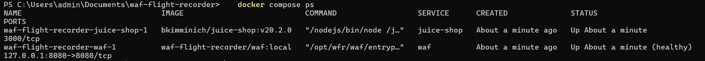

*Both containers up on my laptop, and the WAF healthy.*

The first thing that went wrong: ModSecurity refused to start because some settings aren't allowed inside a single website's config, only at the server level. So the whole ModSecurity config loads from one file, [`modsecurity/main.conf`](modsecurity/main.conf), which also fixes the order everything loads in. That file is the first thing I'd tell anyone to read.

### Phase 1: the flight recorder

**In plain words:** planes carry a black box that records everything, so after an incident you can replay exactly what happened. I gave my guard one. Every single request gets one line in `evidence/raw/audit.json`: what came in, which rules reacted, what the guard decided.

Each request also gets a **transaction ID**, like a parcel tracking number. My WAF sends it back to the visitor in a header called `X-WFR-Transaction`, so I can take any response and find its exact line in the log.

```powershell
curl.exe -i "http://localhost:8080/rest/products/search?q=%27%20OR%201%3D1--"
# curl.exe sends a request from the command line, like a browser without the window.
# -i shows the response headers too, so I can see the status code and the transaction ID.
# %27 is how a ' character is written in a web address, %20 is a space, %3D is =.
```

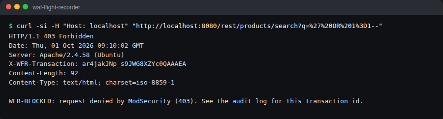

*My WAF refusing the attack with a 403, and the tracking number in the X-WFR-Transaction header.*

Then I learned the two modes a guard can work in:

- **DetectionOnly** is like CCTV with nobody watching live: everything is recorded, but nobody gets stopped. Perfect for a trial run.
- **On** means the guard actually stops people.

I sent the same attack in both modes:

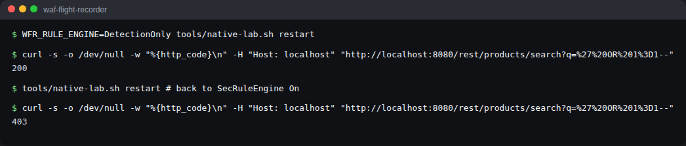

*The same attack twice: 200 when the guard only watches, 403 when it's On.*

Same rules, same score. `200` (it got through) in DetectionOnly, `403` (refused) when enforcing. I wrote up one real log entry part by part: [how I read a transaction](docs/how-to-read-a-transaction.md).

### Phase 2: writing my own rules

#### How a rule works

This is the mental model that made everything else click for me.

Think of the WAF as a **bouncer at a club door**. Every request is a person trying to get in. A **rule** is one instruction on the bouncer's card: "Look at **the name on their ID card**. If it **contains "Albeen-Scanner"**, check it **at the door**, and **refuse entry**."

In ModSecurity's language:

```
SecRule REQUEST_HEADERS:User-Agent "@contains Albeen-Scanner" "id:100080,phase:1,deny,status:403,log,t:none,msg:'My rule'"
```

| Piece | Bouncer version | What it means |
| --- | --- | --- |
| `SecRule` | "Here's an instruction" | Every rule starts with this |
| `REQUEST_HEADERS:User-Agent` | **Where** to look: the ID card | The header where every browser or tool says its name |
| `@contains Albeen-Scanner` | **What** to look for | Match if that text appears anywhere in it |
| `id:100080` | The instruction's number | Unique. Mine go from 100000 to 100999 |
| `phase:1` | **When**: at the door | As soon as the headers arrive, before the body is read |
| `deny,status:403` | **What to do**: refuse entry | Block it and answer with a 403 |
| `t:none` | Clean the input first? No | See "transformations" below |
| `log,msg:'...'` | Write it in the logbook | Record it in the audit log with this message |

Every rule, mine or CRS's, answers the same five questions: where do I look, what am I looking for, when, do I clean the input first, and what do I do about it.

#### When: the five phases

ModSecurity checks a request in stages, like airport security:

| Phase | Airport version | What's available |
| --- | --- | --- |
| 1 | Passport check at the entrance | The address, the method, the headers |
| 2 | Bag scanner | The body too: forms, logins, JSON |
| 3 | Checking what leaves the building (headers) | The response headers |
| 4 | Checking what leaves the building (contents) | The response body |
| 5 | Writing up the logbook at the end of the shift | Everything, for the log |

A rule in the wrong phase can be perfectly written and still useless, because the thing it's looking for hasn't arrived yet. I proved that in Phase 5.

#### What to look for: operators

| Operator | Everyday version | Example |
| --- | --- | --- |
| `@contains` | "Does the name have this word anywhere in it?" | `@contains Albeen-Scanner` |
| `@streq` | "Is it exactly this, nothing more?" | `@streq DELETE` |
| `@beginsWith` | "Does it start with this?" | `@beginsWith /ftp` |
| `@rx` | "Does it fit this pattern?" (a regular expression: a search pattern, like "any word followed by TABLE") | `@rx \bdrop\s+table\b` |
| `@gt` | "Is this number bigger than...?" | `@gt 100` |

#### Cleaning the input first: transformations

Imagine a bouncer whose list says "no entry for JOHN". Someone walks up with an ID that says "john". Different letters, same person. A smart bouncer reads every name in capitals before checking the list. That's a **transformation**: tidying the input before comparing it.

| Transformation | What it does | Example |
| --- | --- | --- |
| `t:none` | Nothing. Check it exactly as it arrived | `John` stays `John` |
| `t:lowercase` | Everything to lowercase | `JoHn` becomes `john` |
| `t:urlDecodeUni` | Decode web address encoding | `%66tp` becomes `ftp` |
| `t:normalizePath` | Clean up messy paths | `/./ftp` becomes `/ftp` |
| `t:length` | Replace the text with how long it is | `apple` becomes `5` |

I learned this one the hard way, on my own rule.

#### My first rules, on my laptop

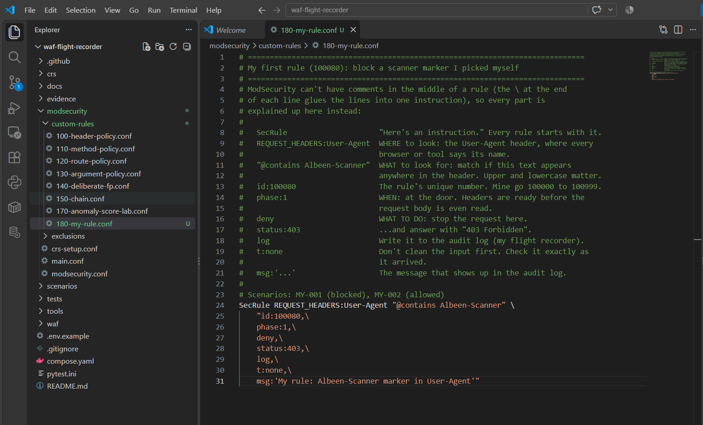

*My first rule, 100080, in VS Code. Every part of it is explained in the comments above it.*

I pretend to be my own scanner. `-A` sets the User-Agent, so it's basically a fake ID card:

```powershell
curl.exe -i -A "Albeen-Scanner/1.0" http://localhost:8080/
# curl.exe sends a request from the command line, like a browser without the window.
# -i shows the response headers too. -A sets the User-Agent: the name on the ID card.
```

`403 Forbidden` and **WFR-BLOCKED**.

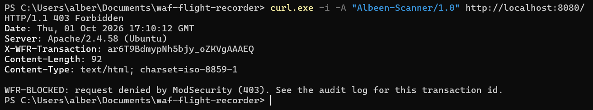

*My fake scanner refused at the door.*

Same scanner name, lowercase:

```powershell
curl.exe -s -o NUL -w "%{http_code}\n" -A "albeen-scanner/1.0" http://localhost:8080/
# Same fake ID card, but written in lowercase
# -s = quiet, -o NUL = throw the page away, -w = print only the status code
```

`200`. It walked straight in. `@contains` cares about upper and lowercase, and `t:none` means nothing tidies the input first. An attacker only has to change one letter.

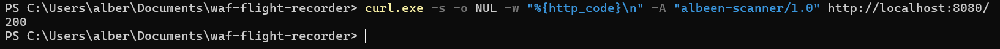

*One lowercase letter, and my rule let it straight in.*

Two small edits: `t:none,` becomes `t:none,t:lowercase,`, and `@contains Albeen-Scanner` becomes `@contains albeen-scanner`. Both 403 now.

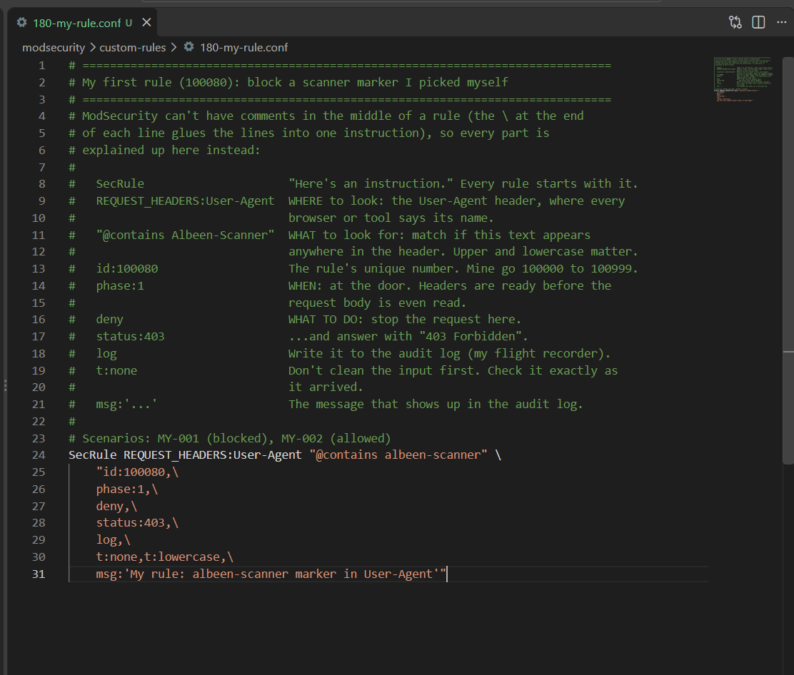

*The fix: t:lowercase tidies the name before checking it.*

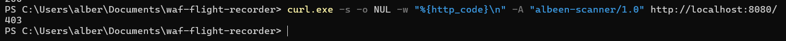

*The lowercase trick blocked now.*

My first rule looked at one thing. Real rules often need two things to be true at once, so for my second rule I wanted to learn a **chain**.

The idea, in everyday terms: a customer at the counter asks for "apple juice". Someone who hands over a 300 word order slip isn't shopping. They're testing what the kitchen does with weird input. Attack tools do exactly that: they stuff long, strange text into search boxes to see what breaks. So rule **100090** blocks product searches longer than 100 characters, and only on the search page.

```powershell
$long = "a" * 120
# Make a text of 120 letter a's. PowerShell can multiply text like that.
curl.exe -s -o NUL -w "%{http_code}\n" "http://localhost:8080/rest/products/search?q=apple"
# A normal search: expect 200
curl.exe -s -o NUL -w "%{http_code}\n" "http://localhost:8080/rest/products/search?q=$long"
# A 120 letter search: expect 403
curl.exe -s -o NUL -w "%{http_code}\n" "http://localhost:8080/api/Products?q=$long"
# The same long text on a different page: expect NOT 403, because the chain only covers the search page
```

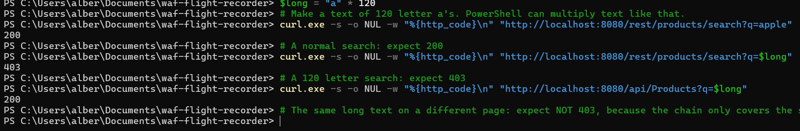

*A normal search gets 200, the 120 letter one gets 403, and the same long text on another page gets 200.*

Then I broke it on purpose. I took `t:length` out of the second condition. The 120 letter search now gets a **200**. Without `t:length`, the guard compares the text "aaaa..." with the number 100. That makes no sense, so it never matches, and the rule silently does nothing. No error, no warning. Just a guard who stopped working.

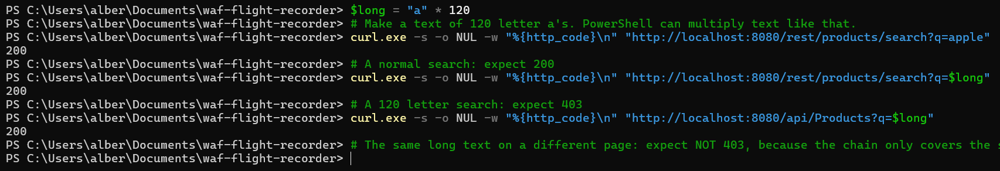

*Without t:length, my rule quietly stopped working.*

`t:length` back in, `docker compose restart waf`, and the long search is a **403** again.

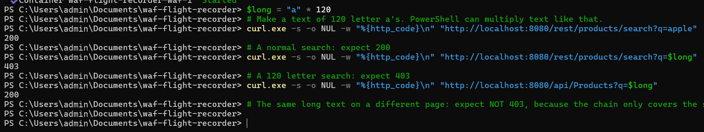

*t:length back in, and the long search is blocked again.*

The lesson I took from this one: a broken rule doesn't always crash. Sometimes it just quietly stops matching. Every step, including the restarts and the audit log, is in [my first rules, step by step](docs/tutorial-first-rule.md).

#### The rules I wrote

Each one teaches one decision:

| Rule | What it does | The lesson |
| --- | --- | --- |
| 100001 | Blocks the lab marker `WFR-Lab-Bot` in the User Agent | Phase 1, one header, and `@contains` cares about uppercase and lowercase |
| 100010 | Refuses WebDAV methods (file sharing commands Juice Shop never uses) with a 405 | `@within` checks "is it hidden anywhere inside", so it would've blocked `PATCH` because it's inside `PROPPATCH`. I used an exact pattern instead |
| 100020 / 100040 | Blocks Juice Shop's exposed `/ftp` folder, written twice: with and without transformations | `/FTP/` walks past the version without `t:lowercase` |
| 100030 | Blocks one named field | Login forms arrive as JSON, and fields come out as `ARGS:email`, not `json.email` like I first guessed |
| 100050 | A rule I made too broad on purpose, then fixed | It blocked someone searching for "cough drops". My own rules need the same care as anyone's |
| 100060 | Two conditions together: `DELETE` *and* the feedback page | Each condition alone is fine. Only the combination is suspicious. That's a **chain** |
| 100070 / 100071 | Adds penalty points, once in phase 2, once in phase 1 | The phase 1 version does nothing at all (see Phase 5) |
| 100080 | My own scanner marker, in any case | My first rule written from zero on my laptop: [the tutorial](docs/tutorial-first-rule.md) |
| 100090 | Blocks product searches longer than 100 characters, only on the search page | A chain of two conditions, and `t:length` to turn text into a number. Without it, the rule silently does nothing: [the tutorial](docs/tutorial-first-rule.md#my-second-rule-two-conditions-and-a-number-instead-of-text) |

Why block `/ftp`? With the guard in DetectionOnly, this is what Juice Shop shows to anyone who asks:

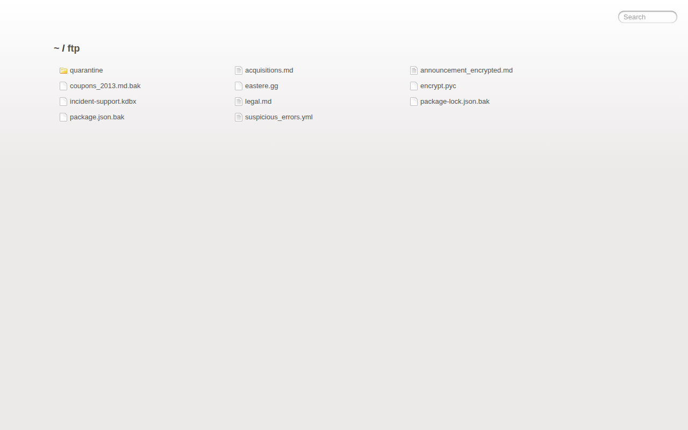

*Juice Shop's /ftp folder, open to anyone while the WAF only watches.*

Backups, a password database, an encrypted announcement. A filing cabinet left open in the lobby. With my rule enforcing, the same address gets this:


*The same address, blocked by my rule.*

Fixing it in the WAF without touching the app is called a **virtual patch**: you can't fix the cabinet today, so you put a guard in front of it.

Every rule has tests for what it must block and what it must let through:

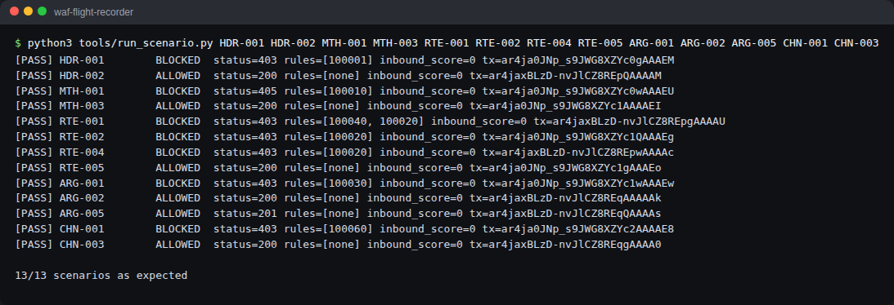

*Every rule tested both ways: what it must block and what it must let through.*

Details for every rule: [ModSecurity notes](docs/modsecurity-notes.md). The rule files explain each choice in their comments: [`modsecurity/custom-rules/`](modsecurity/custom-rules/).

### Phase 3: fire drills that run themselves

**In plain words:** a building doesn't trust its fire alarms because they worked once. It runs drills, regularly. I did the same for my rules.

Every test request is written down as a **scenario**: the request, and what the guard must do with it. Here's a real one:

```yaml
id: HDR-001                                   # the scenario's name tag
name: lab bot marker in User-Agent is blocked # what it checks, in words
request: {method: GET, path: /, headers: {User-Agent: "WFR-Lab-Bot/1.0"}}   # the request to send
expected: {decision: blocked, status: 403, intercepted_by: 100001}          # what MUST happen
```

My test runner sends each one, finds its exact line in the flight recorder by transaction ID, and checks the decision, which rule stopped it, which rules reacted, and the score. It also refuses to send anything anywhere except my lab.

```powershell
docker compose --profile test run --rm tests
# Start the "tests" container (it's in a profile so it doesn't run by default),
# run every scenario against the live WAF, then delete the container (--rm).
```

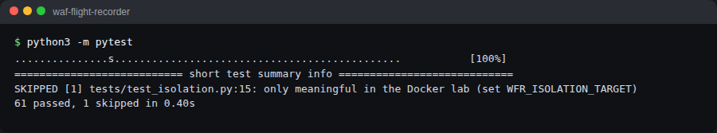

*The whole set of drills, run in the tests container.*

And on my laptop, against the real Juice Shop in Docker. 62 passed, including the check that Juice Shop can't be reached any way except through the WAF:

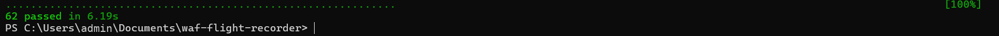

*62 passed on my laptop, against the real Juice Shop.*

After I added my own two rules and six tests of my own: 70 passed.

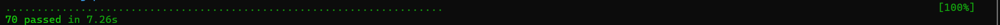

*70 passed after I added my own two rules and their tests.*

Then my first commit to the project:

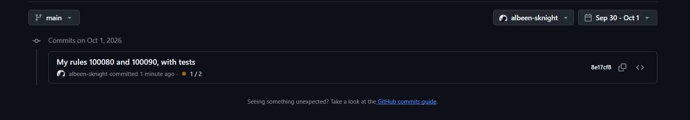

*My first commit: my two rules and their six tests.*

On top of that, **GitHub Actions** (a robot that runs on GitHub's computers) rebuilds the whole lab from scratch and reruns every drill each time I push a change. That's the green tick at the top of this page.

To see the flight recorder in a readable way, one line per request:

```powershell
docker compose --profile test run --rm tests python tools/summarize_audit.py -n 10
# Run my summary script inside the tests container: the last 10 requests,
# with BLOCK or allow, the phase, the score, the status code and the rule IDs.
```

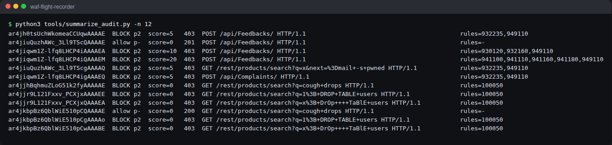

*The flight recorder, one line per request: BLOCK or allow, the score and the rules that fired.*

### Phase 4: the professional rulebook, and the attacks it stops

Then I loaded CRS, the rulebook written by OWASP experts, and attacked the shop with classic test strings. Here's what each attack means in plain words:

| Attack | Everyday version | What I sent |
| --- | --- | --- |
| **SQL injection** | Writing on an order slip: "one coffee, and also tell the cook to open the safe". The kitchen follows written instructions, so it obeys | `' OR 1=1--` as the login email, which tells the database "log me in as whoever, because 1=1 is always true" |
| **XSS** (cross site scripting) | Leaving a note in the guest book that does something to whoever reads it next | `<script>alert(1)</script>` in the search box |
| **Path traversal** | Asking the receptionist for "the room two floors above the archive" to sneak into the boss's office | `../../../../etc/passwd`, climbing up folders to reach a system file |
| **Command injection** | Ordering "a pizza; and also give me the keys to the shop" | `x; cat /etc/passwd`, trying to sneak a system command in |
| **Scanner** | Someone walking in wearing a "burglar" name tag | A `User-Agent` saying `sqlmap`, a well known attack tool |

I turned every attack in that table into a test:


*Every attack from the table, blocked by CRS.*

All blocked. A normal search, of course, goes straight through:

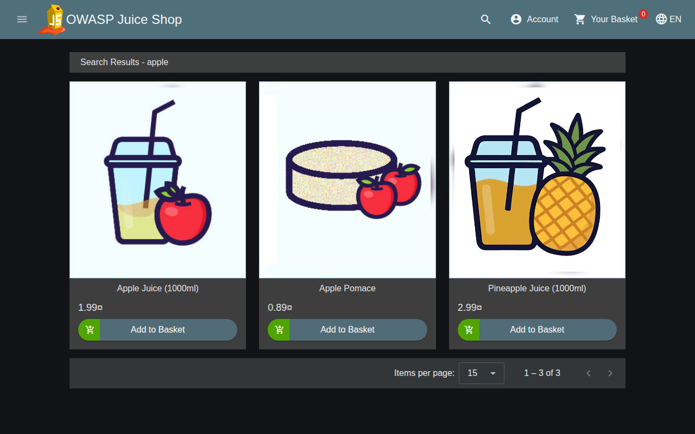

*A normal search for apple goes straight through.*

The famous Juice Shop admin login bypass, `' OR 1=1--` as the email, doesn't log anyone in anymore. The guard stops it before Juice Shop ever sees it:

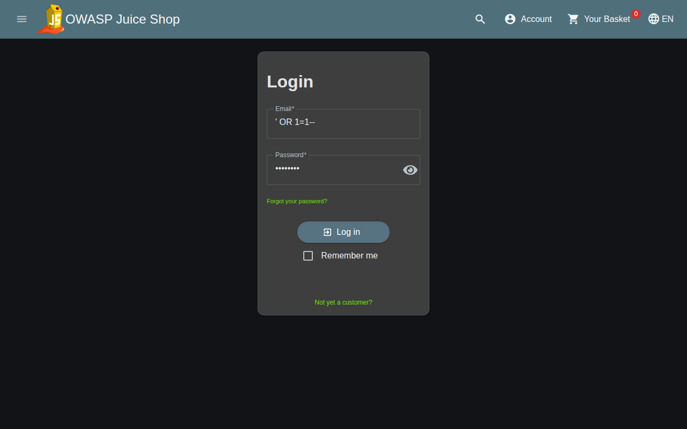

*The WAF blocking my SQL injection on the login page.*

Same thing from my own browser, the first time I ran the lab on my laptop:

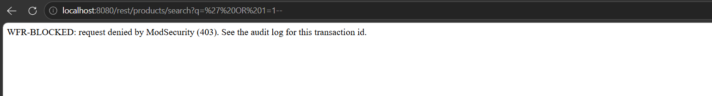

*The same attack blocked in my own browser, on my laptop.*

CRS has a strictness dial called the **paranoia level**, from 1 (relaxed, few false alarms) to 4 (suspicious of everyone). I used level 1.

Seeing a 403 isn't the same as understanding it. So I picked five CRS rules and took each one apart, like a mechanic stripping an engine: what it looks at, how it cleans the input, what it matches, how many points it gives, and what happens when I change exactly one thing about the request.

| Rule | What I found |
| --- | --- |
| [942100](docs/crs-rule-autopsies/942100.md) | It reads SQL like a language instead of matching patterns. `O'Reilly` passes. `1 OR 1=1` doesn't |
| [941110](docs/crs-rule-autopsies/941110.md) | Six cleaning steps decode disguised text before the check even runs |
| [930120](docs/crs-rule-autopsies/930120.md) | Just a list of sensitive file names. No pattern at all |
| [932235](docs/crs-rule-autopsies/932235.md) | Needs a symbol, a command and a gap. A pasted web link supplies two of them by accident |
| [920350](docs/crs-rule-autopsies/920350.md) | Notices a bare IP address instead of a site name. Small points, never blocks on its own |

### Phase 5: penalty points

**In plain words:** CRS works like penalty points on a driving licence. Most rules don't throw you out. They add points: 5 for something serious, 3 or 2 for something odd. At the end, one referee rule (949110) counts the points. Reach the limit (the **threshold**, 5 by default) and you're out.

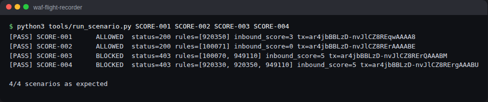

*Penalty points adding up: one oddity stays under 5, two together cross it.*

- Visiting by bare IP address alone scores 3. Logged, allowed.
- Add an empty browser name (2 more) and it reaches 5. Blocked. Two small oddities add up.
- My own points rule in phase 1 got wiped, because CRS resets everyone's points to zero right after. The same rule in phase 2 blocks. Same rule, different moment, completely different result.

Then the experiment that changed how I think about tuning. I raised the limit from 5 to 10:

```powershell
$env:WFR_INBOUND_THRESHOLD="10"; docker compose up -d
# Set a setting for this PowerShell window (the threshold) and restart the lab with it.
docker compose --profile test run --rm tests
# Rerun every drill: every FAIL is an attack that now gets through.
Remove-Item Env:WFR_INBOUND_THRESHOLD; docker compose up -d
# Remove the setting and restart: back to the normal limit of 5.
```

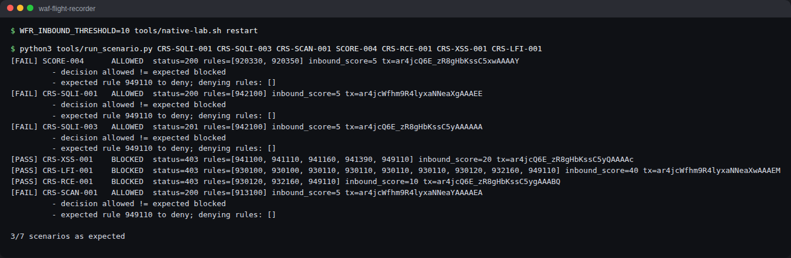

*With the limit at 10, these attacks walk straight through.*

The login bypass, the search SQL injection and the sqlmap scanner all walk straight through. Lots of real attacks trip exactly one serious rule: 5 points. Double the limit and the guard goes blind to all of them, without any warning. Full write up: [anomaly scoring experiment](docs/anomaly-scoring-experiment.md).

### Phase 6: a real false alarm, fixed narrowly

**In plain words:** a **false positive** is a smoke alarm going off because you made toast. The alarm isn't broken. It's doing its job in a place where its job doesn't fit. You don't rip the alarm out of the whole house. You move that one detector away from the toaster.

I threw about 40 realistic customer comments at Juice Shop's feedback form, looking for something CRS would get wrong. The most natural one: a customer pasting a newsletter link.

```
The link https://example.com/?ref=juice&utm_source=mail in your newsletter has a typo
```

Blocked. CRS 932235 sees `=` plus `mail` (a real Unix command) plus a space, and calls it command injection.

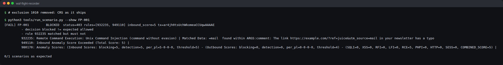

*A customer's newsletter link, blocked as command injection.*

The lazy fixes were right there:

- Delete the rule. (Rip the alarm out of the house.)
- Ignore the comment field everywhere. (Disconnect every alarm in every kitchen.)
- Raise the threshold. (Make every alarm in the building less sensitive.)

Each one opens a hole I'd just measured. So I wrote one **exclusion**: an exception to the rulebook. Mine removes one rule (932235), from one field (`comment`), on one page (the feedback form). Then I proved four things: the comment goes through, real command injection and XSS in that same field are still blocked, the same pattern in another field still gets caught, and the same comment sent to another page still gets blocked.

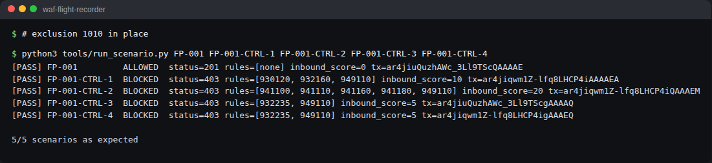

*After my fix: the comment goes through, and all four controls still hold.*

There are two kinds of exception, and the difference matters:

- A **runtime exclusion** is a note for one visitor at one door: "for this request, on this page, skip that one check". That's what I used.
- An exclusion **applied at configure time** rewrites the rulebook for everyone, on every page. Simpler to write, much broader.

Two more tuning cases came out of the build. Out of the box, CRS blocks Juice Shop's own requests to change or remove things in your basket, because it only allows the most common methods. The fix there was a CRS setting, not an exception. And my own rule 100050 blocked a shopper searching for "cough drops":


*My rule 100050 blocking a search for cough drops, then letting it through after my fix.*

Everything is in the [tuning journal](docs/tuning-journal/): [FP-001](docs/tuning-journal/FP-001.md), [FP-002](docs/tuning-journal/FP-002.md), [LAB-F](docs/tuning-journal/LAB-F.md).

## What I learned

- A rule reacting and a visitor getting thrown out are two different events. In CRS, only the referee (949110) throws people out.
- Timing matters. The same rule in the wrong phase does nothing.
- The cleaning steps (transformations) are where a simple rule gets its strength. One lowercase letter got past my first rule until I added `t:lowercase`.
- The threshold isn't a tuning knob for false alarms. It's a switch that turns off detection for every attack that trips exactly one serious rule.
- A good fix is narrow, and it comes with two tests: the honest visitor gets in, and the burglar still gets stopped.
- Writing it down matters as much as building it. The flight recorder is what turns "I think it works" into "here's the proof".

## Run it yourself

You need Docker Desktop running (open it first and wait for "Engine running").

```powershell
git clone https://github.com/albeen-sknight/waf-flight-recorder.git
# Download a copy of this project to your computer.
cd waf-flight-recorder
# Move into the project folder.
docker compose up -d --build
# Build the WAF, download Juice Shop, and start both in the background. Then open http://localhost:8080
docker compose --profile test run --rm tests
# Run every test scenario against the live WAF. It should end with "passed".
docker compose down
# Stop and remove the lab. Your logs stay in evidence/raw/.
```

Poke it by hand:

```powershell
curl.exe -s -o NUL -w "%{http_code}\n" "http://localhost:8080/rest/products/search?q=apple"
# A normal search. -s = quiet, -o NUL = throw the page away, -w prints just the status code: 200
curl.exe -s -o NUL -w "%{http_code}\n" "http://localhost:8080/rest/products/search?q=%27%20OR%201%3D1--"
# The SQL injection from Phase 4: 403, blocked
curl.exe -s -o NUL -w "%{http_code}\n" -A "WFR-Lab-Bot/1.0" http://localhost:8080/
# -A sets the browser name (User-Agent). This one is caught by my rule 100001: 403
```

Experiment switches:

```powershell
$env:WFR_RULE_ENGINE="DetectionOnly"; docker compose up -d
# Guard records everything but stops nobody. Try http://localhost:8080/ftp now.
$env:WFR_INBOUND_THRESHOLD="10"; docker compose up -d
# Double the penalty point limit and watch what slips through.
Remove-Item Env:WFR_RULE_ENGINE, Env:WFR_INBOUND_THRESHOLD -ErrorAction SilentlyContinue; docker compose up -d
# Back to normal.
```

(On Mac or Linux, use `curl` instead of `curl.exe`, and `export WFR_RULE_ENGINE=DetectionOnly` instead of `$env:...`.)

## Glossary

| Term | Plain words |
| --- | --- |
| **WAF** | A guard at a website's door that checks every visitor |
| **Reverse proxy** | A receptionist: visitors talk to it, never to the back office directly |
| **ModSecurity** | The guard: the engine that runs the rules |
| **CRS** | The professional rulebook (OWASP Core Rule Set) |
| **Rule** | One instruction: where to look, what to look for, when, how to clean the input, what to do |
| **Phase** | The moment a rule runs: at the door (1), at the bag scanner (2), on the way out (3, 4), in the logbook (5) |
| **Operator** | How a rule compares: contains, exactly equals, starts with, fits a pattern, bigger than |
| **Transformation** | Cleaning the input before checking it, like reading every name in capitals |
| **Anomaly score** | Penalty points. Reach the threshold and you're blocked |
| **Threshold** | The penalty point limit. 5 here |
| **Paranoia level** | How strict CRS is, 1 (relaxed) to 4 (suspicious of everyone) |
| **DetectionOnly** | CCTV mode: record everything, stop nobody |
| **False positive** | The smoke alarm going off for toast: an honest request blocked |
| **Exclusion** | A written exception to a rule, as narrow as possible |
| **Virtual patch** | A WAF rule that covers a hole in the app until the app gets fixed |
| **Audit log** | The flight recorder: one line per request, everything that happened |
| **Transaction ID** | The tracking number that ties a response to its log line |
| **Scenario** | One written test: a request, and what must happen to it |
| **CI** | A robot that rebuilds and retests everything on every change |
| **Container** | A lunchbox with an app and everything it needs |

## Repository layout

```text
compose.yaml                 the packing list: waf + juice-shop (+ tests, cloudflared)
waf/                         my WAF container: Dockerfile, install.sh, Apache config
modsecurity/
  main.conf                  load order. Read this first
  modsecurity.conf           engine, body reading, the JSON flight recorder
  crs-setup.conf             paranoia level, threshold, allowed methods
  custom-rules/              my rules, IDs 100000 to 100999
  exclusions/                my exceptions, IDs 1000 to 1999 (before and after CRS)
crs/README-version.md        which CRS version, and why it's never edited
scenarios/                   normal/, controls/, false-positive/ (YAML)
tests/                       pytest: scenarios, config checks, isolation
tools/                       scenario runner, log summarizer, native lab, stand in app, screenshots
docs/                        architecture, notes, tutorial, autopsies, scoring, tuning journal, screenshots
evidence/sanitized-samples/  real log entries, cleaned of anything personal (raw logs stay out of git)
```

## Safety

- Juice Shop lives on an internal Docker network with no door to the outside.
- The WAF listens on `127.0.0.1`. My home network can't see it.
- The test runner refuses to send anything that isn't aimed at the lab.
- Synthetic data only. I clean every log sample before committing it.

## What's next

- [x] MVP: ModSecurity, my own rules, tests, notes on reading the log
- [x] V1: CRS, five rule autopsies, penalty point experiments, a real false positive, a narrow exception, regression tests, CI
- [ ] FP-003: my own browser triggered the WAF on a request I never typed (the favicon and its `Referer` header)
- [ ] A private demo link through Cloudflare Tunnel + Access
- [ ] V2: paranoia levels 2 and 3, rules on responses, libModSecurity v3 + Nginx

## References

- [OWASP Juice Shop](https://owasp.org/www-project-juice-shop/) (I use the official image, unmodified)
- [ModSecurity Reference Manual](https://github.com/owasp-modsecurity/ModSecurity/wiki)
- [OWASP CRS docs](https://coreruleset.org/docs/), especially [false positives and tuning](https://coreruleset.org/docs/2-how-crs-works/2-3-false-positives-and-tuning/)
