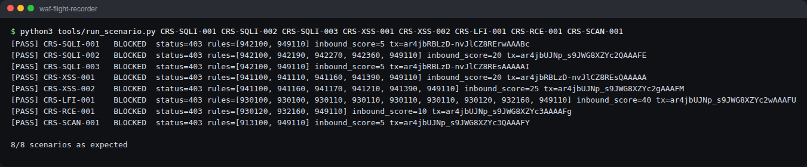

# My CRS rule autopsies

I picked five CRS v4.29.0 rules. Each one starts from a real audit log event in my lab. Then I poked it, changing **one thing about the input at a time**, until I knew exactly what it reacts to. The template comes from my project plan.

Line numbers point to where each `SecRule` starts in `/opt/crs/rules/` at tag v4.29.0. The audit log gives the line where the rule *ends*. 942100 starts at 46 and shows up in the log as 66. That threw me the first time.

| Rule | Category | Severity (points) | Triggered by | What I took away |
| --- | --- | --- | --- | --- |
| [942100](942100.md) | SQL injection (libinjection) | CRITICAL (5) | CRS-SQLI-001, CRS-SQLI-003 | It's a SQL tokenizer, not a regex. `O'Reilly` passes. `1 OR 1=1` doesn't. |
| [941110](941110.md) | XSS, script tag | CRITICAL (5) | CRS-XSS-001 | Six transformations decode HTML entities before the regex even runs. |
| [930120](930120.md) | Local file inclusion | CRITICAL (5) | CRS-LFI-001 | A phrase list loaded from a data file (`@pmFromFile`). No regex at all. |
| [932235](932235.md) | Unix command injection | CRITICAL (5) | FP-001 | The rule behind my real false positive. |
| [920350](920350.md) | Protocol enforcement | WARNING (3) | SCORE-001 | Matches. Never blocks on its own at threshold 5. |

The rule that does the actual **denying** isn't on this list. [949110](../anomaly-scoring-experiment.md#how-the-decision-gets-made) compares the summed score with the threshold. Every rule above uses `block`, and in CRS anomaly mode `block` means "do the default action". The default is `pass`.
