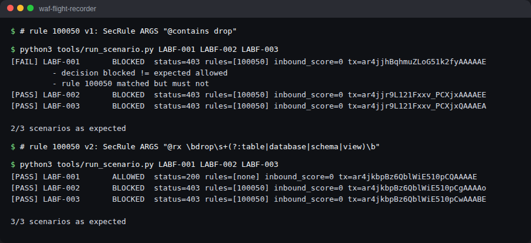

# LAB-F: A rule of mine that was too broad on purpose, and the narrow fix

Rule **100050**, in `modsecurity/custom-rules/140-deliberate-fp.conf`.



## v1: too broad (deliberately)

```apache
SecRule ARGS "@contains drop" "id:100050,phase:2,deny,status:403,t:none,t:lowercase,..."
```

My idea: stop `DROP TABLE` in any parameter.

| Request | Result |
| --- | --- |
| `GET /rest/products/search?q=cough drops` | **BLOCKED** 403 by 100050. False positive ([sample](../../evidence/sanitized-samples/labf-before-cough-drops-blocked.json)) |
| `GET /rest/products/search?q=1; DROP TABLE users` | BLOCKED by 100050 ([sample](../../evidence/sanitized-samples/labf-before-drop-table-blocked.json)) |

`@contains` is a substring test. `drop` lives inside `drops`, `dropdown`, `raindrop`, `Dropbox`. Of course it misfired.

## What went wrong

My rule looked for a **fragment of a word**. The threat is a **statement**.

## v2: narrowed

```apache
SecRule ARGS "@rx \bdrop\s+(?:table|database|schema|view)\b" \
    "id:100050,phase:2,deny,status:403,t:none,t:lowercase,t:compressWhitespace,..."
```

- `\b…\b`: whole words only.
- `drop` has to be followed by whitespace and an object type.
- `t:lowercase` + `t:compressWhitespace`: `DrOp    TaBlE` collapses to `drop table`.

| Scenario | Request | v1 | v2 |
| --- | --- | --- | --- |
| LABF-001 | `q=cough drops` | blocked | **allowed** ([sample](../../evidence/sanitized-samples/labf-after-cough-drops-allowed.json)) |
| LABF-002 | `q=1; DROP TABLE users` | blocked | **blocked** ([sample](../../evidence/sanitized-samples/labf-after-drop-table-blocked.json)) |
| LABF-003 | `q=x; DrOp    TaBlE users` | blocked | **blocked** |

## What I took from it

My rules are code too. They get the same treatment as a CRS false positive: evidence, a tighter condition, and a test for the legit case and the attack. CRS already handles SQL injection far better (942xxx). I wrote this rule so I could practise the tuning loop on something of my own.
