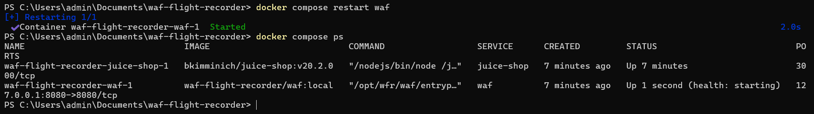
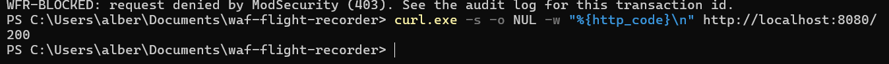
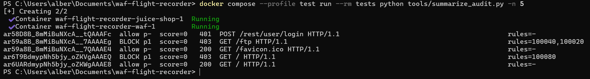
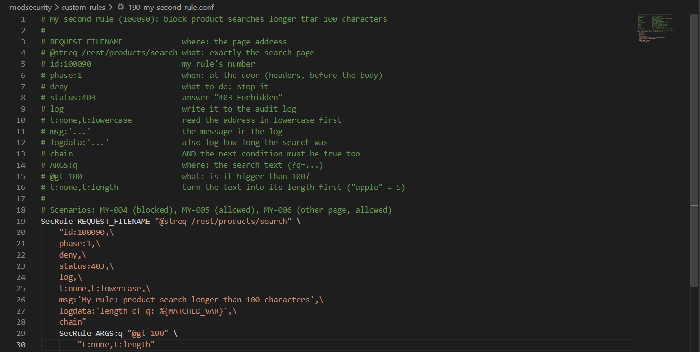
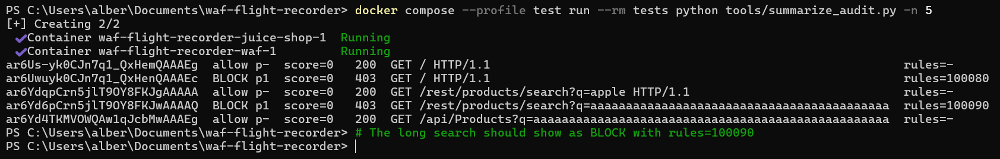
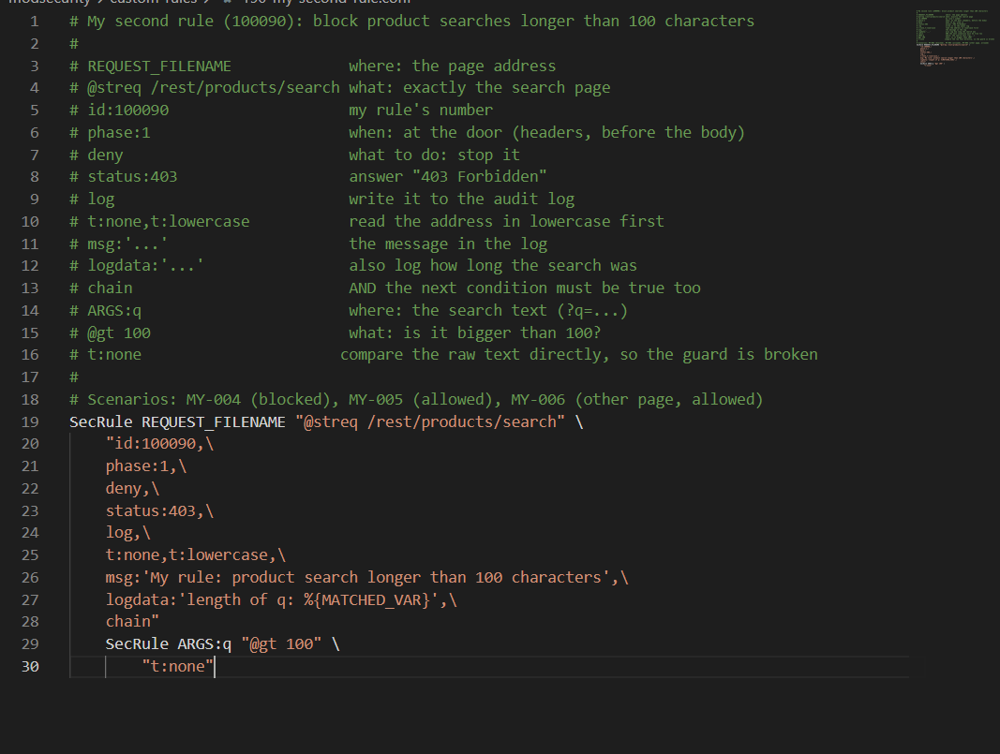
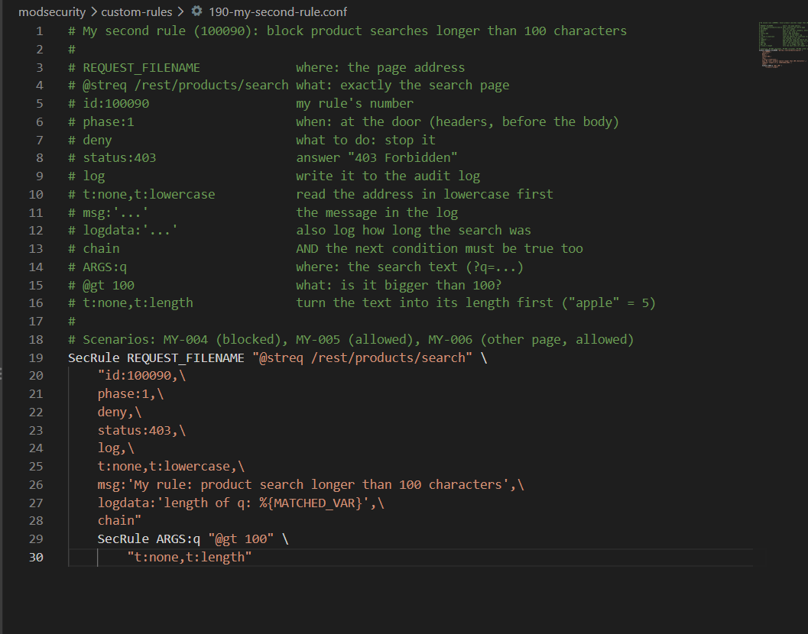

# How I write a WAF rule: the tutorial I wish I'd had

When I started, a line like this meant nothing to me:

```
SecRule REQUEST_HEADERS:User-Agent "@contains Albeen-Scanner" "id:100080,phase:1,deny,status:403,log,t:none,msg:'My rule'"
```

Now it reads like a sentence. This is how I got there, step by step, on my own laptop (Windows, Docker Desktop, PowerShell, VS Code). Every screenshot below is from my own run on October 1, 2026.

## What a rule actually is

Think of the WAF as a **bouncer at a club door**. Every request is a person trying to get in. A **rule** is one instruction written on the bouncer's card:

> "Look at **the name on their ID card**. If it **contains "Albeen-Scanner"**, check it **at the door, before they walk in**, and **refuse entry**."

That's exactly what the line above says, in ModSecurity's language:

| Piece | Bouncer version | What it means |
| --- | --- | --- |
| `SecRule` | "Here's an instruction" | Every rule starts with this |
| `REQUEST_HEADERS:User-Agent` | **Where** to look: the ID card | The `User-Agent` header, where every browser or tool says its name |
| `@contains Albeen-Scanner` | **What** to look for | Match if that text appears anywhere in it |
| `id:100080` | The instruction's number | Every rule needs a unique number. Mine go from 100000 to 100999 |
| `phase:1` | **When**: at the door | Phase 1 runs as soon as the headers arrive, before the request body is read |
| `deny,status:403` | **What to do**: refuse entry | Block the request and answer with a 403 |
| `t:none` | Clean the input first? No | Transformations tidy the input before checking it, lowercasing for example. `none` means check it exactly as it arrived |
| `log,msg:'...'` | Write it in the logbook | Record it in the audit log with this message |

Every rule I write answers the same five questions: **where do I look, what am I looking for, when, do I clean the input first, and what do I do about it.**

## Step 1: Open the project in VS Code

From PowerShell, inside the project folder:

```powershell
code .   # open the current folder in VS Code (the . means "this folder")
```

If that doesn't work: VS Code → File → Open Folder → `Documents\waf-flight-recorder`.

## Step 2: Create the rule file

In VS Code's file list, `modsecurity` → `custom-rules`, right click → **New File** → `180-my-rule.conf`. This is what I put in it:

```
# =============================================================================
# My first rule (100080): block a scanner marker I picked myself
# =============================================================================
# ModSecurity can't have comments in the middle of a rule (the \ at the end
# of each line glues the lines into one instruction), so every part is
# explained up here instead:
#
#   SecRule                     "Here's an instruction." Every rule starts with it.
#   REQUEST_HEADERS:User-Agent  WHERE to look: the User-Agent header, where every
#                               browser or tool says its name.
#   "@contains Albeen-Scanner"  WHAT to look for: match if this text appears
#                               anywhere in the header. Upper and lowercase matter.
#   id:100080                   The rule's unique number. Mine go 100000 to 100999.
#   phase:1                     WHEN: at the door. Headers are ready before the
#                               request body is even read.
#   deny                        WHAT TO DO: stop the request here.
#   status:403                  ...and answer with "403 Forbidden".
#   log                         Write it to the audit log (my flight recorder).
#   t:none                      Don't clean the input first. Check it exactly as
#                               it arrived.
#   msg:'...'                   The message that shows up in the audit log.
#
# Scenarios: MY-001 (blocked), MY-002 (allowed)
SecRule REQUEST_HEADERS:User-Agent "@contains Albeen-Scanner" \
    "id:100080,\
    phase:1,\
    deny,\
    status:403,\
    log,\
    t:none,\
    msg:'My rule: Albeen-Scanner marker in User-Agent'"
```

Two things that tripped me up:

- The `\` at the end of a line means "this instruction carries on in the next line". Forget one and the WAF won't start.
- You **can't** put a `#` comment between those lines. It breaks the rule. All the explaining goes above it.


## Step 3: Load the rule

The WAF only reads its rule files when it starts. So after every edit:

```powershell
docker compose restart waf   # restart only the WAF container so it rereads its rule files
docker compose ps            # list the containers and their status
```

I wait until the `waf` line says `healthy`. If it never gets there, I made a typo, and this tells me where:

```powershell
docker compose logs waf --tail 20   # show the last 20 lines the WAF printed, errors included
```



Right after a restart it says `health: starting`. A few seconds later it's `healthy`.

## Step 4: Test it

I pretend to be my own scanner. `-A` sets the User-Agent, so it's basically a fake ID card:

```powershell
curl.exe -i -A "Albeen-Scanner/1.0" http://localhost:8080/
# curl.exe sends a request from the command line, like a browser without the window.
# -i shows the response headers too. -A sets the User-Agent: the name on the ID card.
```

`403 Forbidden` and **WFR-BLOCKED**. Then a normal visitor:


```powershell
curl.exe -s -o NUL -w "%{http_code}\n" http://localhost:8080/
# -s = quiet, -o NUL = throw the page away, -w = print only the status code
```

`200`. They get in.



(In PowerShell it has to be `curl.exe`. Plain `curl` there is a different command.)

## Step 5: Read the logbook

```powershell
docker compose --profile test run --rm tests python tools/summarize_audit.py -n 5
# Run my log summary script inside the tests container: one line per request,
# for the last 5 requests. --rm deletes the container again when it's done.
```

My request shows up as `BLOCK` with `rules=100080`. That's the proof the rule fired, and not something else.



The line above it is the normal visitor, allowed with no rules matched. Further up, my `/ftp` visit, blocked by 100040 and 100020.

## Step 6: Break it

Same scanner name, lowercase:

```powershell
curl.exe -s -o NUL -w "%{http_code}\n" -A "albeen-scanner/1.0" http://localhost:8080/
# Same fake ID card, but written in lowercase
```

`200`. It walked straight in. `@contains` cares about upper and lowercase, and `t:none` means nothing tidies the input first. An attacker only has to change one letter.


## Step 7: Fix it

Two small edits:

- `t:none,` becomes `t:none,t:lowercase,`. Lowercase the input before checking.
- `@contains Albeen-Scanner` becomes `@contains albeen-scanner`. Compare against lowercase text.

`docker compose restart waf`, then both curl commands from Steps 4 and 6 again. Both 403 now.


## What I took from it

That's the whole engineering loop, on a rule I wrote myself: write it, test it, find the hole, close it with a transformation, test again. The same idea scales all the way up to CRS. Its rules are just this, with smarter "where", "what" and many more transformations. My [autopsies](crs-rule-autopsies/) of five CRS rules use exactly these same five questions.

## My second rule: two conditions, and a number instead of text

My first rule looked at one thing. Real rules often need two things to be true at once, so for my second rule I wanted to learn a **chain**.

The idea, in everyday terms: a customer at the counter asks for "apple juice". Someone who hands over a 300 word order slip isn't shopping. They're testing what the kitchen does with weird input. Attack tools do exactly that: they stuff long, strange text into search boxes to see what breaks. So rule **100090** blocks product searches longer than 100 characters, and only on the search page.

Three new ideas in one rule:

- **`chain`** links two `SecRule`s. Both have to be true: "it's the search page" AND "the search text is too long". Each condition alone is fine.
- **`@gt 100`** is the operator "greater than 100".
- **`t:length`** is a transformation that swaps the text for its length. `apple` becomes `5`. That's what lets `@gt` compare it with a number.

This time I kept the comments short: one line per piece, in the same order as the rule below them, so the whole file fits on one screen.



### Testing it

```powershell
$long = "a" * 120
# Make a text of 120 letter a's. PowerShell can multiply text like that.
curl.exe -s -o NUL -w "%{http_code}\n" "http://localhost:8080/rest/products/search?q=apple"
# A normal search: expect 200
curl.exe -s -o NUL -w "%{http_code}\n" "http://localhost:8080/rest/products/search?q=$long"
# A 120 letter search: expect 403
curl.exe -s -o NUL -w "%{http_code}\n" "http://localhost:8080/api/Products?q=$long"
# The same long text on a different page: expect NOT 403, because the chain only covers the search page
```


The logbook agrees: the long search is the only one blocked, by `100090`. The long text sent to `/api/Products` went through, because that page isn't the search page:



### Breaking it

I took `t:length` out of the second condition, so it's just `t:none`. I even changed my comment to say what that does: compare the raw text directly.



The 120 letter search now gets a **200**. Without `t:length`, the guard compares the text "aaaa..." with the number 100. That makes no sense, so it never matches, and the rule silently does nothing. No error, no warning. Just a guard who stopped working.


### Fixing it

`t:length` back in, `docker compose restart waf`, and the long search is a **403** again.




The lesson I took from this one: a broken rule doesn't always crash. Sometimes it just quietly stops matching. That's exactly why the next step matters.

## Turning both rules into tests, and my first commit

Testing by hand proves a rule works today. Tests prove it keeps working. I wrote six scenarios in `scenarios/controls/my-rules.yaml`, three per rule: the attack gets blocked, the normal request gets through, and one edge case (the lowercase trick for 100080, a long search on a different page for 100090). Each one looks like this:

```yaml
id: MY-004                                                   # the test's name tag
name: a product search longer than 100 characters is blocked # what it checks, in words
request: {method: GET, path: /rest/products/search, params: {q: "aaaa...120 a's..."}}   # what to send
expected: {decision: blocked, status: 403, intercepted_by: 100090}                       # what MUST happen
```

Then the whole suite:

```powershell
docker compose --profile test run --rm --build tests
# Run every test. --build makes the test container pick up my new YAML file.
```

70 passed: the original 62, my six scenarios, and two config checks that run once for every rule file (one each for my two files).


Then my first commit to the project:

```powershell
git add modsecurity/custom-rules/180-my-rule.conf modsecurity/custom-rules/190-my-second-rule.conf scenarios/controls/my-rules.yaml
# Choose exactly which files go into this commit: my two rules and their tests
git commit -m "My rules 100080 and 100090, with tests"
# Save a snapshot with a message saying what changed
git push
# Send it to GitHub
```


GitHub Actions then rebuilt the whole lab with the real Juice Shop and ran every test against my rules. Green tick.
